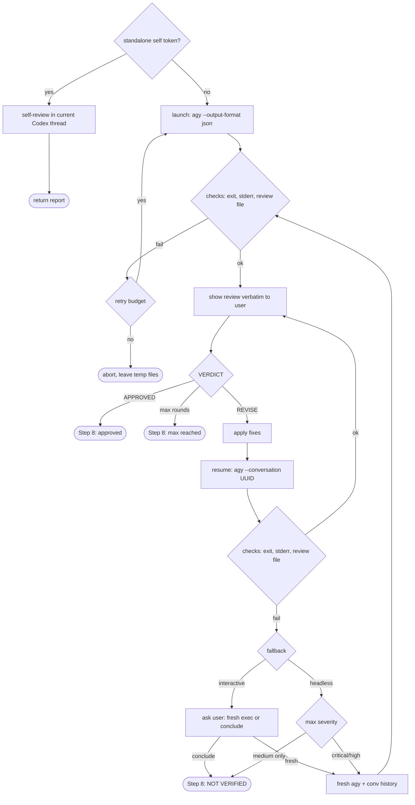

# Design Notes — adversarial-review

This document records the *why* behind the current implementation of the
`adversarial-review` skill: the empirical facts about external tools it
depends on, the rationale for each non-obvious design decision, and the
alternatives that were considered and rejected. Read `SKILL.md` for
*what* the skill does step by step; read this file when you need to
understand *why it does it that way* before changing something.

---

## §0. Purpose and audience

### Why this file exists

The skill orchestrates two AI systems (OpenAI Codex as the lead/master, Antigravity CLI (agy)
as the external reviewer) through a CLI subprocess interface. The
observable behavior of the skill depends on details of the Codex CLI
(stream splitting, exit codes, flag support), on details of the
Codex harness (tool output size, model interpretation of
instructions), and on a set of trade-offs between token cost,
robustness, and operator ergonomics. Those details drift with each new
Codex release and each new Codex model version. A maintainer reading
only `SKILL.md` sees the instructions but not which facts are
load-bearing and which are historical accidents — and so may undo a
subtle fix during a refactor.

This file fixes that. It names the facts, the decisions, the rejected
alternatives, and — importantly — the prior diagnostic reports that
turned out to be wrong. The goal is that a contributor six months from
now can change the skill confidently instead of re-discovering the
terrain.

### Audiences

1. **A future Codex agent** resuming work on the skill in a fresh session.
   It knows Codex in general but has no memory of the discussion
   that produced the current design.
2. **A human developer** who knows git and bash but does not know the
   Codex internals or the Antigravity CLI quirks.
3. **A contributor** who wants to add a feature (new reviewer backend,
   CI integration) and needs to know what invariants to preserve.

### What this file is NOT

- Not a user guide — that is `README.md`.
- Not authoritative on current behavior — `SKILL.md` is. This file
  explains why `SKILL.md` is written the way it is. If the two
  disagree, `SKILL.md` wins; fix this file.

### How to use this file

If you are about to modify the skill:

1. Skim `§1. System context` to recall the flow.
2. Find the step you want to change in `§4. Design decisions` — each
   decision lists which `SKILL.md` step it ties into.
3. Check `§2. Antigravity CLI empirical facts` for the environment
   assumptions you are about to lean on. If the date in `§8. Version
   and verification log` is older than a few agy releases, re-verify
   before trusting.
4. Run `§7. Smoke test protocol` before and after your change. If the
   before-run already fails, stop and investigate — don't layer a
   change on top of undetected drift.

---

## §1. System context

### One paragraph

`adversarial-review` is a Codex skill with two backends. With the standalone
`self` argument, Codex takes a terminal branch before any external setup and
performs a read-only adversarial review in the current thread. Otherwise Codex
(the "lead/master") writes an adversarial review prompt to a temp file,
launches `agy --print` with that file's contents as one prompt argument, and
extracts `.response` from the JSON result. Codex then shows the external review
to the user verbatim, applies fixes to the plan or code, and re-submits the
revised state through `agy --conversation <UUID>`. The external loop runs up to
five rounds, or until the reviewer emits `VERDICT: APPROVED`.

### Roles

- **Lead (Codex).** Orchestrator. Reads `SKILL.md`, runs the Bash /
  Write / Read / Edit tools, authors the fixes, decides when to stop.
- **Self reviewer (Codex, opt-in).** The same current thread applies the
  adversarial rubric directly. It does not delegate, invoke agy, or apply
  fixes.
- **Reviewer (Antigravity, `gemini-3.7-flash`, effort high).** External AI process invoked per round. Receives
  the adversarial prompt, reads repo/plan content in agy plan mode,
  and emits a structured review with `VERDICT:`. See §9.7 for the
  headless-permissions and sandbox trade-off in agy 1.1.12.
- **User.** Reads the verbatim review Codex shows each round,
  accepts/rejects the skill's final result.

### Flow



The diagram collapses retries and round counting; for the exact
ordering see the strict check lists in `SKILL.md` Steps 4 and 7.

### Why an external reviewer at all

An adversarial review from the *same* model as the writer tends toward
validation bias. Running the review through a different model family
(Antigravity CLI with `gemini-3.7-flash`, effort high) reduces shared blind spots. The cost is an external
dependency and a CLI-level integration — which is exactly what most of
this document exists to manage. Self mode is an explicit convenience trade-off:
it preserves the rubric and review discipline when external execution is
undesired or unavailable, but does not claim independent-model diversity.

---

## §2. Antigravity CLI empirical facts (v1.1.12 through v1.1.17)

The transport contract was verified on `agy 1.1.12` on 2026-08-13. The
interrupted-stream behavior and completed-review/missing-file behavior were
re-verified on `agy 1.1.14` on 2026-08-18 (see
`§8. Version and verification log`). The stricter `find_by_name` argument
contract and an ordinary initial review launch were verified on `agy 1.1.17`
on 2026-08-21; the older resume edge cases were not re-run for that release.
The prior text in this section was
mechanically inherited from Codex CLI 0.121.0 during the agy migration;
those Codex-specific flags and stream semantics were never valid agy facts.
Re-run `§7` after upgrading agy.

### §2.1. Invocation shapes

Headless mode requires the prompt as an argument to `-p` / `--print`:

```bash
agy -p "PROMPT" [OPTIONS]
agy -p "PROMPT" --conversation UUID [OPTIONS]  # explicit resume
agy -p "PROMPT" --continue [OPTIONS]           # newest conversation
```

**Superseded migration assumption:** ~~`cat prompt.md | agy --print -`
feeds stdin to agy.~~ In agy 1.1.12 the positional `-` is not a stdin
sentinel. The command can exit 0 while ignoring the file and returning a
generic greeting. This is the exact failure reported under review id
`1786638300-60419327`.

The skill keeps the prompt in a file for marker binding and diagnostics,
then passes it as one argument:

```bash
agy --print "$(cat /tmp/agy-prompt-*.md)" ...
```

Quoted command substitution is safe for XML/Markdown prompt text: expansion
produces one argv element and is not re-evaluated as shell syntax. It strips
trailing newlines only, which does not change the prompt contract. Extremely
large prompts remain bounded by the platform's argv-size limit; agy 1.1.12
exposes no prompt-file flag.

### §2.2. Output streams

With `--output-format json`, stdout is one JSON object, not an event stream:

```json
{
  "conversation_id": "<uuid>",
  "status": "SUCCESS",
  "response": "<final reviewer text>",
  "duration_seconds": 3.7,
  "num_turns": 1,
  "usage": {}
}
```

Stderr is empty on a clean run and carries CLI diagnostics on failure. The
runner stores the object in `/tmp/agy-stdout-${REVIEW_ID}.jsonl`; the `.jsonl`
suffix is retained for compatibility with existing cleanup and archive paths,
although the file contains a single JSON value. A separate Python extraction
writes `.response` to `/tmp/agy-review-${REVIEW_ID}.md`.

On agy 1.1.14, a model-stream interruption can instead produce exit 1 with a
parseable JSON object: `status=ERROR`, empty `response`, generic
`error="Agent execution terminated due to error."`, and a valid
`conversation_id`; stderr can still be empty. The bound transcript contains
the specific `The stream was interrupted` error. Resuming that exact UUID can
finish the review, but the JSON `status` and `error` are sticky conversation
state: a later clean no-tool turn returned a complete response and exit 0 while
the envelope still reported the earlier `ERROR`. Therefore status alone is
strict for ordinary launches but cannot prove that a marker-bound recovery turn
failed; §4.15 defines the narrow transcript guard used for that one case.

agy 1.1.14 can also return exit 0 with `status=ERROR`, a complete non-empty
review response, and a valid UUID after the model recovers from a read-only
`view_file` call for a nonexistent path. Review `1787067240-58420371` did this
after guessing `<repo>/package.json`; the actual frontend manifest was nested.
Its marker-bound transcript ended in `PLANNER_RESPONSE/DONE` whose content
exactly matched the JSON response and contained `VERDICT: APPROVED`, while the
envelope retained the earlier `invalid_args`/`no such file or directory`
diagnostic. §4.16 defines the only allowlisted completed-turn guard for this
separate signature. The guard is implemented as deterministic code in
`scripts/runner_contract.py`, not as reviewer judgment.

**Superseded migration assumptions:** ~~`--json` emits `thread.started`
JSONL events~~ and ~~`-o FILE` stores the final response.~~ Those were Codex
CLI behaviors. agy uses `--output-format json`, the field is
`conversation_id`, and the runner performs the review-file extraction.

### §2.3. Session persistence

agy persists a conversation transcript at:

```
~/.gemini/antigravity-cli/brain/<UUID>/.system_generated/logs/transcript_full.jsonl
```

The directory name is the conversation id accepted by `--conversation`.
The transcript contains the original prompt, including the attempt-scoped
`ADVERSARIAL-REVIEW-SESSION` marker. The runner therefore retains its
positive content-bound filesystem fallback:

```bash
find ~/.gemini/antigravity-cli/brain -name 'transcript_full.jsonl' \
  -newer /tmp/agy-prompt-${REVIEW_ID}.md \
  -exec grep -l "ADVERSARIAL-REVIEW-SESSION: ${REVIEW_ID}-${ATTEMPT_ID}" {} +
```

Exactly one match is required. The UUID is the first path component below
`brain/`; zero or multiple matches fail closed as defined in `§4.1`.

### §2.4. Resume semantics

Use `--conversation UUID` to resume a specific reviewer conversation. Use
`--continue` only to select the newest conversation for the workspace; the
skill never does this because unrelated parallel agy work could be selected.
Do not combine the two flags.

**§2.4.1. `--continue` is implicit selection.** The CLI chooses a recent
conversation rather than binding the command to the id captured by this
review. That is sufficient reason to exclude it from the skill, independent
of any cwd filtering details.

**§2.4.2. Process cwd does not fully bind native tool cwd.** agy 1.1.14 has no
`-C` / `--cd` flag. Even when the runner launched after
`cd "${REPO_ROOT}"`, review `1787067240-58420371` gave the first native
`run_command` call `Cwd=~/.gemini/antigravity-cli/scratch`; its relative
`git diff` failed before the model rediscovered the repository. The runner now
keeps the `cd` prefix, adds `--add-dir "${REPO_ROOT}"`, supplies an explicit
absolute repository context, and requires reviewer diff commands to use
`git -C "${REPO_ROOT}"`. File reads/searches use absolute rooted paths.

**§2.4.3. Bad UUID silently creates a conversation.** On 1.1.12 a nonexistent
id passed through `--conversation` writes `warning: conversation "..." not
found` to stderr, exits **0**, and returns `SUCCESS` with a new
`conversation_id`. The runner therefore rejects the warning and independently
requires every resume result id (primary or transcript fallback) to equal the
requested id. A valid verdict does not override this equality check.

**§2.4.4. Conversation ID remains stable across resume.** On 1.1.12 and in the
1.1.14 interrupted-stream recovery probe, an
initial headless call and a successful `--conversation <that-id>` call both
return the same `conversation_id`. The runner still refreshes the value from
every successful REVISE response so a future rotation cannot silently drift.

### §2.5. Known failure modes

| Trigger | Exit | stdout | stderr | Review extraction |
|---|---:|---|---|---|
| Success | 0 | one JSON object | empty | `.response` contains verdict |
| Prompt piped with positional `-` | 0 observed | success JSON with generic greeting | empty | no verdict; rejected |
| External timeout | 124 | partial or empty | partial or empty | rejected |
| Invalid model/auth | non-zero or non-SUCCESS JSON | empty/error JSON | diagnostic possible | rejected |
| Missing `--conversation` UUID | 0 observed | SUCCESS JSON with a new UUID | warning | rejected by warning/id equality |
| 1.1.14 interrupted model stream | 1 observed | ERROR JSON, empty response, valid UUID | empty observed | marker-bound conversation recovery uses the one retry |
| Clean turn after an interrupted 1.1.14 conversation | 0 observed | complete response but sticky ERROR/error | empty observed | accepted only by §4.15's current-turn transcript guard |
| Recovered read-only `view_file` ENOENT | 0 observed | complete response plus ERROR/invalid_args and valid UUID | empty observed | accepted only by §4.16's marker-bound completed-turn guard and warning |
| 1.1.17 `find_by_name` without `Pattern` | 0 observed | complete response plus ERROR/`missing property 'Pattern'` and valid UUID | empty observed | rejected; §4.17 prevents the malformed call in reviewer prompts |
| Malformed JSON or empty response | may be 0 | malformed/empty | may be empty | empty review; rejected |

The semantic verdict check remains mandatory even after exit 0 because the
broken stdin invocation demonstrates that transport success is not prompt
application success.

### §2.6. CLI gaps relevant to the skill

- No prompt-file or documented stdin-prompt mode in agy 1.1.12 or 1.1.14.
- No cwd flag. Use the `cd` prefix for the process, `--add-dir` for workspace
  registration, `git -C` for every supplied diff command, and absolute paths
  for file reads/searches. Process cwd alone is insufficient on 1.1.14.
- `--output-format json` is a single object; use `stream-json` only when an
  event stream is actually wanted (the skill does not).
- `--print-timeout` defaults to 5 minutes, so the runner sets `10m` to align
  it with the outer `timeout 600` guard.
- Reviewer intent is constrained with `--mode plan` and an explicit no-write,
  static-review-only instruction in every initial, fresh, resume, and
  interrupted-stream recovery prompt.
  Plan mode does not by itself prohibit shell commands: the prompt separately
  limits evidence gathering to the supplied read-only `git diff` commands plus
  file read/search and forbids builds, compilation, tests, and other project
  execution.
  `--dangerously-skip-permissions` is also required because headless agy cannot
  prompt to approve the supplied `git diff` commands; auto-approval is
  therefore bounded by the reviewer prompt. agy 1.1.12's
  `--sandbox` is not used because repeated real-diff runs ended with
  `status=ERROR` and a sandbox-server connection reset (§9.7).
- agy 1.1.14 adds `--disable-slash-commands`, but combining it with
  `--mode plan` prints `--mode plan has no effect while slash command expansion
  is disabled`. The runner does not use that apparent transport workaround
  because it would silently remove the additional plan-mode guard.
- agy 1.1.17 requires a non-empty `Pattern` in every native `find_by_name`
  call. Omitting it can leave the top-level envelope at `status=ERROR` even if
  the reviewer corrects the call and later produces a complete verdict. Every
  reviewer prompt therefore states the required argument explicitly, using
  `Pattern: "*"` for directory enumeration, and the deterministic prompt
  contract requires that instruction before launch.

---

## §3. Codex harness facts

These facts apply to the Codex runtime (the "harness") that
executes the skill, verified during work on this refactor.

### §3.1. Bash tool

- Returns combined stdout + stderr as the tool result text.
- Truncates output at approximately 30 KB. Under truncation, the *tail*
  is retained; the *head* is dropped. This is why Codex's `session id:`
  metadata line (printed before a potentially long reasoning trace) can
  disappear from the Bash result under load — the real root of the old
  session-id bug, not anything wrong with Codex.
- Current working directory is treated as transient between calls. Do
  not depend on `cd` persisting, and do not rely on `$(pwd)` in
  composed commands; capture the absolute path once via a deterministic
  source (see `§4.2`).

### §3.2. Write and Read tools

- Bypass the Bash truncation limit entirely. Prompts longer than a few
  kilobytes should be written to a file and fed to the external
  subprocess via pipe (`cat file | cmd -`) rather than embedded as a
  Bash argument. See `§4.13` for why pipe is preferred over the
  `- < file` redirect form.
- Read can open any file — there is no skill-level restriction.

### §3.3. Safety rules on destructive git operations

The harness includes a built-in "Git Push to Default Branch" safety
rule that blocks `git push origin master` (or `main`) unless the user
has explicitly granted a permission. The skill does not push, so this
does not affect runtime, but it is relevant when releasing skill
changes: maintainer must push master themselves or add a permission.

### §3.4. Model interpretation of instructions

Later model releases may interpret SKILL.md instructions more
literally than earlier ones. An instruction like "Show the user
verbatim" without a hard procedural anchor can be internally
rationalized as "the context already contains the review, the user
sees the context" and skipped. Current design compensates with:

- A strict "YOUR NEXT MESSAGE to the user must begin with ..." clause
  (`SKILL.md` Step 5) that names the message, not just the act.
- Architectural enforcement: `--output-format json` puts a machine-
  readable object in stdout, and the runner extracts `.response` into
  the review file. The lead *cannot* satisfy the "show the review" contract
  by quoting from the Bash result, because the Bash result has no
  review text in the first place.

See `§4.9` for the rejected-marker-file alternative.

---

## §4. Design decisions

Each decision below follows the same template:

- **Decision** — one sentence.
- **Where in SKILL.md** — step reference.
- **Context** — the problem it addresses.
- **Alternatives considered** — with reasons for rejection.
- **Chosen because** — the load-bearing argument.
- **Trade-offs accepted** — what we gave up.

### §4.1. Two-tier conversation ID capture (`--output-format json` primary, attempt-scoped content-bind secondary)

- **Decision.** Every agy launch writes its single JSON result to
  `/tmp/agy-stdout-${REVIEW_ID}.jsonl`. Every prompt starts with
  `<!-- ADVERSARIAL-REVIEW-SESSION: ${REVIEW_ID}-${ATTEMPT_ID} -->`,
  where `ATTEMPT_ID` is regenerated per launch. Capture then tries:
  - **Primary:** parse the JSON object's `conversation_id`.
  - **Secondary:** require exactly one `transcript_full.jsonl` that is
    newer than the prompt file and contains this launch's full marker;
    extract the UUID directory immediately below `brain/`.
- **Where in SKILL.md.** Step 4, Step 7 resume, and Step 7 fresh-exec;
  the mechanics are centralized in `references/runner.md` R4.4.
- **Context.** The primary is agy's documented machine-readable result.
  The secondary preserves fail-closed recovery if stdout is malformed or
  lacks the field. Attempt scoping prevents a retry or parallel agy call
  from silently binding the wrong conversation (`§6.7`, `§6.8`).
- **Alternatives considered.**
  - *Timestamp-only newest transcript.* Rejected: parallel-call race.
  - *Review-stable marker only.* Rejected: first attempt and retry can
    both match.
  - *Dedicated marker file.* Rejected: the prompt file already provides
    both the mtime anchor and embedded marker.
  - *Plain-text stdout.* Rejected: loses structured `conversation_id` and
    weakens the show-review boundary in `§4.9`.
- **Chosen because.** The primary is direct and cheap; the secondary is
  positively bound to this exact launch rather than inferred by timing.
- **Trade-offs accepted.** Every prompt gets a leading comment; fallback
  needs read access to the Antigravity brain directory. Capture is skipped
  after APPROVED because no further resume is needed.

### §4.2. Capture `REPO_ROOT` at Step 2, substitute literally

- **Decision.** At Step 2, run `git rev-parse --show-toplevel` once,
  save the absolute path as `REPO_ROOT`, and substitute it verbatim
  (quoted) into every agy command. Do not use `$(pwd)` in composed
  commands.
- **Where in SKILL.md.** Step 2 (capture), Steps 4 and 7 (use).
- **Context.** All reviewer launches need a stable cwd. If the cwd is evaluated at Bash-call
  time via `$(pwd)`, it is susceptible to the harness's weak
  cwd-persistence between calls (§3.1).
- **Alternatives considered.**
  - *`$(pwd)` everywhere.* Rejected: cwd drift.
  - *`pwd -P` at each call.* Same problem, plus added complexity.
- **Chosen because.** One capture, many uses, all deterministic.
- **Trade-offs accepted.** Requires error handling for bare repos
  (exit 128) and awareness of submodule scoping — the skill aborts on
  bare repos with a clear message and warns on submodules (see
  `SKILL.md` Step 2).

### §4.3. Bind process, workspace, commands, and file paths to `REPO_ROOT`

- **Decision.** Prefix every initial, fresh-exec, and resume call with
  `cd "${REPO_ROOT}" &&`, pass `--add-dir "${REPO_ROOT}"`, include the
  absolute root in every prompt, require every supplied diff command to use
  `git -C "${REPO_ROOT}"`, and instruct file tools to use absolute rooted
  paths. agy 1.1.14 has no cwd flag and its native command tool can otherwise
  start in the CLI scratch directory.
- **Where in SKILL.md.** Steps 3–4 and 7; runner R2–R3.
- **Context.** The runner's ambient cwd and agy's native tool cwd are separate
  concerns. All rounds must inspect the same repository without spending a
  model turn rediscovering it.
- **Alternatives considered.** *Rely on ambient cwd.* Rejected: §3.1.
  *Use only the process `cd` prefix.* Rejected after review
  `1787067240-58420371`; retained as historical context in §5.8.
- **Chosen because.** Each layer has an explicit root binding, while
  `git -C` makes the permitted diff commands correct even if the native tool's
  `Cwd` remains scratch.
- **Trade-offs accepted.** The repository path is inserted into shell syntax
  and prompt text, so Step 2 rejects unsafe path characters. `--add-dir` is
  defense in depth; correctness of diff commands does not depend on it.

### §4.4. Conditional `AGY_CONVERSATION_ID` update (only on full success)

- **Decision.** Update `AGY_CONVERSATION_ID` only after exit 0, sane
  stderr, a parseable response with a valid verdict, and (for REVISE)
  successful primary or secondary id capture.
- **Where in SKILL.md.** Step 7.
- **Context.** Transport success alone does not prove that agy applied the
  prompt: the broken stdin form exited 0 with a generic greeting. An
  unconditional update could bind later rounds to a non-review response.
- **Alternatives considered.**
  - *Unconditional update.* Rejected: demonstrated poisoning on bad
    model invocations during review.
  - *Update on exit 0 only.* Rejected by the greeting-with-exit-0 incident.
- **Chosen because.** All three checks together give a reliable "the
  session actually produced a review" signal.
- **Trade-offs accepted.** More conditions to specify and execute, but
  they are already required for the review-file sanity check — marginal
  cost.

### §4.5. No implicit `--continue` in any fallback

- **Decision.** The fallback chain uses only explicit
  `--conversation <UUID>` or a fresh execution; it never uses
  `--continue`.
  On resume failure the skill either asks the user (interactive) or
  chooses by severity (headless); the "retry" option is always a fresh
  `agy`, not implicit resume.
- **Where in SKILL.md.** Step 7 fallback.
- **Context.** `--continue` selects a recent conversation rather than
  the id captured for this review (§2.4.1), so it can choose an
  unrelated one-shot or parallel user invocation.
- **Alternatives considered.**
  - *`--continue` as first fallback.* Rejected: wrong-session hazard; if
    the user happens to be running agy interactively in the same
    repo, the skill's "I've revised based on your feedback ..."
    message would be injected into the user's unrelated work.
- **Chosen because.** The safety failure mode is catastrophic (silent
  incorrect reviews, context injection into user's sessions); the cost
  of skipping this shortcut is modest (one more fresh exec per failure,
  which is rare).
- **Trade-offs accepted.** Slightly higher token cost on the rare
  resume-failure path.

### §4.6. Fresh-exec fallback rebuilds context from conversation history

- **Decision.** When the fallback triggers a fresh `agy`, Codex
  reconstructs the "previous rounds" section of the prompt from the
  conversation — the round-1 review, round-1 fixes, round-2 review,
  round-2 fixes, etc. — which were already shown verbatim to the user
  in earlier Step 5 outputs. Every original template places a review-scoped
  `ADVERSARIAL-REVIEW-CONTRACT` boundary before task content. The helper
  validates only the trusted prefix before its first occurrence, so quoted
  policy/context tags or quoted later copies in verbatim history cannot cause
  a false input error; the runtime review id prevents pre-boundary artifact
  text from spoofing it.
- **Where in SKILL.md.** Step 7 fallback prompt template.
- **Context.** The extracted file at `/tmp/agy-review-${REVIEW_ID}.md` is
  overwritten on every round. Round-1 review content is gone from disk
  by the time a round-3 fallback triggers.
- **Alternatives considered.**
  - *Per-round file naming* (`-r1.md`, `-r2.md`, ...). Rejected: user
    preference for minimizing file proliferation. Also required
    matching changes in Step 9 cleanup globs.
  - *Archive the previous extracted review before overwrite.* Rejected: adds
    complexity (pre-write copy step) for a case that triggers rarely.
- **Chosen because.** The Step 5 "show review verbatim" contract
  already ensures the content is in conversation history. Leveraging
  that makes a new step unnecessary.
- **Trade-offs accepted.** Depends on the conversation context window
  preserving prior outputs. If Codex compacts the context
  mid-review, the fallback template may be degraded. No mitigation
  currently; see `§9. Known limitations`.

### §4.7. Semantic VERDICT + findings check (no byte threshold)

- **Decision.** Step 5 sanity checks the review file by regex only. The
  file must contain a line matching `^VERDICT: (APPROVED|REVISE)$`; if
  the verdict is REVISE, it must also contain at least one line
  matching `\[severity:\s*(critical|high|medium)`.
- **Where in SKILL.md.** Step 5.
- **Context.** An earlier draft used a byte-size threshold (`< 50
  bytes = launch failure`). A legitimate terse approval (`VERDICT:
  APPROVED\n`, 17 bytes) would be misclassified. Worse, a REVISE
  verdict with no findings would pass a byte check but create an
  infinite-loop hazard: nothing to fix, resubmit empty fixes, same
  verdict, loop until max rounds.
- **Alternatives considered.**
  - *Byte threshold.* Rejected as above.
  - *Require only `VERDICT:`.* Rejected: REVISE-without-findings loop.
- **Chosen because.** Semantics over heuristic; catches both the
  terse-approval false positive and the empty-REVISE infinite loop.
- **Trade-offs accepted.** Depends on the reviewer emitting the
  `[severity:` marker format prescribed by the prompt. Enforced via
  prompt wording; prompt drift would be a separate failure mode (see
  §6).

### §4.8. Strict check order: diagnostic JSON → exit → stderr → JSON → review → id capture

- **Decision.** After every fresh or `--conversation` agy call,
  checks run in a fixed order:
  1. Opportunistically parse JSON fields for diagnostics and the exact §4.15
     interrupted-stream and §4.16 read-only missing-file classifications;
     neither classification alone accepts a review.
  2. Exit code.
  3. Stderr file (even on exit 0).
  4. Strict JSON parse, status, and requested-id equality on resume. Ordinary
     launches still require `status=SUCCESS`; only §4.15's marker-bound
     interrupted recovery and §4.16's allowlisted completed-turn guard can
     pass with `ERROR`.
  5. Extracted review file semantic sanity.
  6. Conversation-id capture (two-tier, `§4.1`). In Step 4 this is skipped
     on `VERDICT: APPROVED` — no resume will happen, so no session
     is needed. In Step 7 it is a defensive refresh (conversation id
     doesn't rotate per `§2.4.4`) and is skipped identically on
     APPROVED.
- **Where in SKILL.md.** Steps 4 and 7 post-launch.
- **Context.** Non-zero exit implies the JSON response may not exist, but agy
  1.1.14 demonstrated that it can also carry the only useful diagnostic UUID,
  error, and sometimes a completed response in a parseable JSON object while
  stderr is empty. Parsing that envelope before the exit check preserves
  diagnostics without weakening the marker-bound acceptance checks. Exit 0
  still does not imply
  that agy applied the prompt (§2.5). Review sanity before id capture keeps the
  two concerns orthogonal: a broken review aborts on its own merits,
  and a valid APPROVED review completes without depending on
  session-id capture. An earlier draft ordered session-id *before*
  review-sanity, which meant a secondary-capture failure (e.g.,
  empty `~/.gemini/antigravity-cli/brain/` on a first-ever agy run, or a rollout
  that somehow lacked the session marker) would abort an otherwise-
  successful APPROVED round. The current order avoids that.
- **Alternatives considered.**
  - *Ad-hoc checks in whatever order.* Rejected: invites null-pointer-
    style crashes on missing files.
  - *All-at-once check, aggregate errors.* Rejected: harder for Codex
    to follow step-by-step; harder to recover partial information.
- **Chosen because.** Deterministic, fail-fast, each check's output
  points to the next action.
- **Trade-offs accepted.** Slightly verbose to describe.

### §4.9. Hardened "show review" gate, no marker file

- **Decision.** The gate enforcing verbatim review output is
  text-based, repeated in three places (Step 4 anti-confusion note,
  Step 5 YOUR-NEXT-MESSAGE instruction, Step 6 precondition check),
  and backstopped by the architectural fact that JSON stdout is
  non-human-readable so the review can only be accessed via Read on
  the extracted review file.
- **Where in SKILL.md.** Steps 4, 5, 6.
- **Context.** Earlier design used only "Show the user verbatim" in
  Step 5. Observed behavior: the main model received the review (began applying
  fixes that referenced it) but never displayed it to the user. Soft
  instructions can be internally rationalized away (§3.4).
- **Alternatives considered.**
  - *Marker-file precondition* — Codex writes
    `/tmp/agy-review-${REVIEW_ID}.shown` as the act of showing; Step
    6 verifies the file exists. Rejected: cargo-cult risk. A literal
    reader that skips the show step may still write the marker,
    producing a false audit trail that is worse than no trail. And the
    marker cannot be programmatically enforced from within SKILL.md
    — it is still instructional.
  - *Leave as soft "Show verbatim".* Rejected: the observed bug.
- **Chosen because.** Machine-readable stdout does more to prevent the bug
  than any textual instruction: with stdout as a JSON object, there is
  no review text in the Bash tool result for the main model to accidentally
  consume instead of re-reading the extracted file. The triple text gate
  is belt-and-braces.
- **Trade-offs accepted.** Relies on model compliance with the text
  gate. If a future model slips past all three, we will need another
  architectural hook (possibly a verifiable marker after all).

### §4.10. Conditional cleanup (keep temp files on abort)

- **Decision.** Step 9 cleans up `/tmp/agy-*-${REVIEW_ID}.*` only on
  success paths (APPROVED, MAX rounds, NOT VERIFIED). On abort paths
  (launch failure, infrastructure error), the files are left in place.
- **Where in SKILL.md.** Step 9.
- **Context.** When the skill aborts, diagnostics live in the stderr
  and stdout temp files. Cleaning them up immediately makes post-hoc
  debugging impossible.
- **Alternatives considered.**
  - *Always clean up.* Rejected: loses forensics on the cases you
    most want forensics for.
  - *Per-round naming to preserve history across rounds.* Rejected:
    see §4.6.
- **Chosen because.** The abort path is rare and the files are small.
  The trade-off between a few KB of residual `/tmp` content and the
  ability to understand a failure is lopsided.
- **Trade-offs accepted.** Residual files accumulate in `/tmp`. The OS
  will clear them on reboot; a later successful invocation with the
  same `REVIEW_ID` collides with probability ~10⁻⁸ per same-second
  invocation (8-digit random).

### §4.11. Ask-user on resume failure in interactive mode; severity-based in headless

- **Decision.** When resume fails (one of the three checks in §4.8):
  - Interactive: ask the user to choose between (a) fresh exec with
    prior context, or (b) conclude the review as NOT VERIFIED.
  - Headless: auto-fresh-exec if max severity of last round is
    critical/high; auto-NOT-VERIFIED if only medium.
- **Where in SKILL.md.** Step 7 fallback.
- **Context.** Fresh exec is expensive (token-wise) and sometimes
  unnecessary (if the last round's findings were medium, skipping
  re-verification is often acceptable). An unconditional fresh exec
  wastes tokens; an unconditional conclude-as-not-verified risks
  shipping with a critical finding unaddressed.
- **Alternatives considered.**
  - *Unconditional fresh exec.* Rejected: cost and user-interruption
    model.
  - *Unconditional NOT-VERIFIED.* Rejected: critical/high findings
    could be silently skipped.
  - *Always ask the user.* Rejected: no way to ask in headless
    (scheduled, CI) contexts.
- **Chosen because.** Respects the user's "minimize interruptions"
  preference while preserving correctness for serious findings. The
  severity parsing uses a tight regex (§6's lesson on format drift);
  zero matches defaults to critical for safety.
- **Trade-offs accepted.** Severity parsing is a soft dependency on
  reviewer output format; see `§5` for alternatives considered.

### §4.12. Per-round retry budget separate from the round counter

- **Decision.** Step 5 launch-failure retry is capped at 1 per round
  and does NOT consume the 5-round counter. The counter advances only
  when a *valid* review (one that passes §4.7 checks) has been
  produced. For §4.15's exact marker-bound stream interruption, the same retry
  continues the failed conversation; all other failures repeat the original
  launch shape.
- **Where in SKILL.md.** Step 5.
- **Context.** A launch failure is an infrastructure issue, not a
  failed review. Counting it against the round budget would be
  inappropriate — the user would get four rounds of review instead of
  five because of a flaky agy launch.
- **Alternatives considered.**
  - *Retry consumes a round.* Rejected: see above.
  - *Unlimited retries.* Rejected: creates an infinite loop on
    persistent infrastructure failure.
- **Chosen because.** The one-retry cap bounds the cost; preserving an
  interrupted conversation avoids paying to rediscover the same repository
  state, while the separate-counter rule preserves the user's 5-round
  expectation.
- **Trade-offs accepted.** The retry counter lives in the lead's
  round-local reasoning — if an implementer treats it as global across
  rounds, retry budget is inconsistently available. Rules section of
  `SKILL.md` states this explicitly.

### §4.13. Canonical prompt delivery as one `--print` argument

- **Decision.** Keep prompts in files, but invoke agy as
  `agy --print "$(cat /tmp/agy-prompt-*.md)" ...`. Never pipe the file
  on stdin and never pass positional `-`.
- **Where in SKILL.md.** Runner R3 for initial, fresh-exec, and resume.
- **Context.** agy 1.1.12 headless mode requires a prompt argument.
  The migrated stdin form exited 0 yet returned a generic greeting, so
  neither exit nor stderr detected that the prompt was ignored.
- **Alternatives considered.**
  - *`cat file | agy --print -`.* Rejected by the observed incident;
    retained historically in §5.7.
  - *`agy --print - < file`.* Rejected for the same reason: agy has no
    documented stdin sentinel.
  - *Inline the generated prompt directly in the Bash source.* Rejected:
    prompt text must not become shell syntax and the file is still needed
    as the transcript-marker mtime anchor.
- **Chosen because.** Quoted command substitution supplies the exact
  multiline content as one argv element without re-parsing it as shell
  code, while preserving the existing prompt artifact and marker binding.
- **Trade-offs accepted.** Trailing newlines are stripped and the prompt
  is subject to the OS argv-size limit. After agy returns, the runner saves
  `$?` as `agy_rc`, extracts `.response`, and exits with `agy_rc`; without
  that explicit preservation, the extraction command would mask agy's exit.

### §4.14. Static-only reviewer execution boundary

- **Decision.** Every initial, fresh-exec, resume, and interruption-recovery
  prompt contains the same
  `<review_method>` block: Antigravity may obtain the supplied diffs, read and
  search repository files, and trace code/data/control flow, but must not run
  repository-hygiene checks, builds, compilation, tests, linting, formatting,
  dependency operations, generators, migrations, project scripts,
  applications, services, or containers. The runner fails closed before launch
  if the policy block or its required anchors are missing or duplicated.
- **Where in SKILL.md.** Step 4's plan/code prompt templates, Step 7.1's resume
  template, and the Rules summary. Fresh-exec reconstructs the original Step 4
  prompt, so it inherits the same block. `references/runner.md` Step R2 performs
  the mechanical pre-launch check.
- **Context.** The former `Operate read-only` rule prevented source edits but
  did not distinguish static review from verification. A real review report
  included `git status --short --branch`, `git diff --check`, three Maven/JUnit
  executions, and `mvn test-compile`. Only diff inspection, source search, and
  static path tracing contributed to the reviewer role; the rest duplicated the
  implementation agent's verification work and consumed substantial time.
  Repository-local instructions can also tell an agent to run tests, so the
  reviewer policy must explicitly take precedence over them.
- **Alternatives considered.**
  - *Keep only `Operate read-only`.* Rejected: builds and tests can leave source
    files untouched and were therefore treated as compatible with that wording.
  - *Rely on `--mode plan`.* Rejected: execution mode does not provide a
    semantic allowlist for shell commands.
  - *Remove `--dangerously-skip-permissions`.* Rejected for the current
    transport: agy 1.1.12 then auto-denied the required `git diff` and returned
    a useless empty response (§9.7).
  - *Use `--sandbox` as the command boundary.* Rejected: it does not express
    “allow diff/search but deny test/build,” and the 1.1.12 sandbox was unstable
    on real-diff reviews (§9.7).
- **Chosen because.** The allowlist of review activities, detailed deny list,
  explicit precedence over repository instructions, no-`Verification` output
  rule, repetition on resume, and runner preflight check jointly address both
  the observed behavior and likely aliases/wrappers without coupling the skill
  to Maven alone.
- **Trade-offs accepted.** Command classification remains prompt-enforced
  inside agy rather than an OS-level per-process allowlist. The runner guarantees
  that the policy reaches every launch, but a future agy release with a portable
  per-run command allowlist would provide stronger enforcement and should be
  preferred after re-running §7.

### §4.15. Marker-bound recovery for sticky interrupted streams

- **Decision.** Treat only one agy 1.1.14 failure signature as resumable:
  `status=ERROR`, empty response, generic agent-termination error, valid UUID,
  current attempt marker in that UUID's transcript, and the exact
  `The stream was interrupted` transcript error after the marker. Spend the
  existing second invocation by resuming that UUID with a fresh attempt marker
  and a compact static-only continuation prompt. Never start a third call.
- **Acceptance guard.** A resumed conversation may keep its old `ERROR`
  envelope. Accept it only when the returned UUID is unchanged, the response
  passes the normal verdict/finding checks, and records after the recovery
  marker contain no `ERROR_MESSAGE` and end in a completed
  `PLANNER_RESPONSE` equal to the JSON response after stripping trailing CR/LF
  from both values (agy adds one trailing newline to JSON). Surface a warning.
  Every other non-`SUCCESS` result remains a launch failure except the separate
  §4.16 completed-review/missing-file signature.
- **Where.** `references/runner.md` R4.0–R5; the main thread only receives the
  normal result JSON and optional `user_warning`.
- **Context.** Review `1787048123-58310427` failed twice because both retry
  attempts discarded a valid conversation after an interrupted stream. A
  manual `--conversation` continuation finished the review. agy then proved
  that status is sticky by returning the same complete verdict on a clean
  no-tool turn with exit 0 while retaining the prior `ERROR` envelope.
- **Alternatives considered.** Accept any valid response under `status=ERROR`
  was rejected because sandbox and tool failures can also produce plausible
  partial reviews. Adding a third call was rejected because it breaks the
  two-invocation budget. `--disable-slash-commands` was rejected because agy
  explicitly disables `--mode plan` with it.
- **Chosen because.** Positive marker binding, UUID equality, current-turn
  transcript checks, and normal semantic review validation distinguish a
  completed recovery turn from both a partial response and an unrelated
  conversation without relaxing the ordinary fail-closed path.
- **Trade-offs accepted.** The recovery depends on agy's persisted transcript
  schema. Schema drift fails closed and leaves the JSON/transcript diagnostic
  in the runner rather than accepting an uncertain review.

### §4.16. Marker-bound completion after a read-only missing-file error

- **Decision.** Permit a non-`SUCCESS` completed review only when the error is
  the exact agy 1.1.14 permission-conversion form for `view_file`, is
  `invalid_args`, ends in `no such file or directory`, and names a path below
  `REPO_ROOT`. Require exit 0; canonical containment with no `.`/`..` path
  traversal; proof that the failed path was not supplied by the trusted task
  header; an immutable initial-prompt copy so resume/fresh-exec cannot lose
  that proof; rejection when either the original or current prompt supplies the
  path; a later marker-bound `PLANNER_RESPONSE/DONE` containing exactly one
  tool call, structurally parsed as `name=view_file` with a different
  repository-local `args.AbsolutePath` of the same basename, immediately
  followed by the empirical non-empty `GENERIC/DONE` result; a
  non-empty response; valid
  UUID and resume equality; normal verdict/finding checks; no subsequent
  transcript `ERROR_MESSAGE`; and a final `PLANNER_RESPONSE/DONE` whose content
  exactly equals the returned response after trimming trailing CR/LF. Surface
  a warning.
- **Where.** `references/runner.md` R4.0–R4.3 delegates the security-critical
  predicate to `scripts/runner_contract.py`; deterministic negative fixtures
  live in `scripts/test_runner_contract.py`.
- **Context.** Review `1787067240-58420371` inspected the complete task diff,
  recovered from guessing a nonexistent root `package.json`, found the nested
  manifest, and ended with `VERDICT: APPROVED`. agy nevertheless retained the
  recovered read failure as top-level `status=ERROR`, so the runner discarded
  a semantically and transcript-complete review.
- **Alternatives considered.** Accept any non-empty response under `ERROR` was
  rejected because permission, command, sandbox, and partial-agent failures can
  produce plausible text. Reject every such response was the previous
  fail-closed rule, but it causes false launch failures for a fully completed
  marker-bound turn. Retrying first was rejected because it spends the bounded
  retry and can reproduce the same harmless discovery miss.
- **Chosen because.** The allowlist is narrower than the observed failure:
  exit 0 only, read-only tool only, canonical repository-local auxiliary path,
  positive proof of recovery through the same filename, exact current-turn
  transcript completion, normal semantic review validation, and a visible
  warning.
- **Trade-offs accepted.** Changes in agy's error wording fail closed until
  re-verified. The guard intentionally does not cover failed commands, writes,
  permission denials, paths outside the repository, or other tools.

### §4.17. Pin the agy 1.1.17 `find_by_name` argument contract in every prompt

- **Decision.** Require every initial, fresh-exec, resume, and recovery prompt
  to tell the reviewer that `find_by_name` needs a non-empty `Pattern`, with
  `Pattern: "*"` for directory enumeration. Make the deterministic prompt
  validator require the same exact anchor before the review-scoped boundary.
- **Where.** All three `<review_method>` templates in `SKILL.md`, the R2 prompt
  check in `references/runner.md`, and deterministic fixtures in
  `scripts/test_runner_contract.py`.
- **Context.** Review `1787304800-73194628` under agy 1.1.17 issued a
  repository-local, read-only `find_by_name` call without `Pattern`. The model
  corrected the call with `Pattern: "*"` and completed an APPROVED response,
  but the JSON envelope retained `status=ERROR` with
  `invalid arguments: missing property 'Pattern'`, so the fail-closed runner
  correctly rejected the review.
- **Alternatives considered.** Accepting any complete-looking response with
  this top-level error was rejected because official headless semantics define
  non-`SUCCESS` as failure and response plausibility does not prove a clean
  turn. A transcript allowlist was rejected because preventing the malformed
  call is simpler and preserves the existing strict envelope contract.
- **Chosen because.** The instruction directly supplies the newly required
  argument, applies to the only observed incompatible tool, and is enforced
  before agy launches rather than repaired after a failed turn.
- **Trade-offs accepted.** This remains a model-facing compatibility rule. A
  future native-tool schema change will fail closed and require another
  versioned prompt-contract update.

---

## §5. Rejected ideas

Ideas that came up in adversarial review rounds or in exploration and
were rejected. Documenting them so a future contributor doesn't
re-propose them without reading why.

### §5.1. Marker file (`.shown` precondition)

Round 2 adversarial review proposed requiring the lead to write
`/tmp/agy-review-${REVIEW_ID}.shown` as an atomic "I have shown the
review" signal, with Step 6 hard-gating on its existence.

Rejected: the marker is itself an instructional artifact. A literal
reader who skips the show step may also write the marker, producing a
false audit trail — strictly worse than a visible skip, because it
masquerades as compliance. The real fix was architectural (`--json`
making review text inaccessible from Bash output, forcing a Read).

### §5.2. Per-round file naming

Proposed during Round 2 review: name temp files with both `${REVIEW_ID}`
and round number (`/tmp/agy-review-${REVIEW_ID}-r1.md`,
`...-r2.md`). Benefits: prior-round diagnostics survive later rounds;
fresh-exec fallback can read prior review text from disk.

Rejected: user preference for minimizing file proliferation; the Step
5 verbatim-output contract already places prior reviews in the
conversation history, which is where `§4.6` draws from.

### §5.3. Stderr parsing for session ID

The historical approach. Works in non-`--json` mode (the `session id:`
line is reliably printed to stderr), but fragile under Bash tool
output truncation (§3.1). Replaced by `--json` + first-line JSONL
parsing (§4.1).

### §5.4. `$(pwd)` in composed commands

An intuitive but fragile shortcut. The Codex shell tool does not
persist cwd reliably between calls, so `$(pwd)` can resolve to an
unexpected directory. Replaced by the single-capture `REPO_ROOT`
pattern (§4.2).

### §5.5. Auto-fresh-exec without user consent on resume failure

Earlier skill drafts silently ran a fresh `agy` whenever resume
failed. This burned significant tokens (each fresh exec is a full
project re-read) for cases that sometimes were not worth re-verifying
(e.g., only medium-severity findings). Replaced by ask-user /
severity-based fallback (§4.11).

### §5.6. Always cleaning up temp files on exit

Earlier Step 9 unconditionally ran `rm -f` on all temp files at
end-of-run. That erased diagnostic trail for abort paths. Replaced by
conditional cleanup (§4.10).

### §5.7. Pipe prompt file to agy stdin

The initial agy migration retained the Codex-era command
`cat prompt.md | agy --print -`. It appeared attractive because it kept long
prompts out of shell arguments and preserved the previous permission shape.

Rejected after agy 1.1.12 returned exit 0, empty stderr, and a generic greeting
instead of applying the prompt. `-` is not a documented stdin sentinel for agy.
Replaced by the quoted one-argument form in §4.13.

### §5.8. Process `cd` as the only repository binding

The original agy design prefixed every launch with
`cd "${REPO_ROOT}" &&` and assumed native tools inherited that cwd.

Rejected after agy 1.1.14 review `1787067240-58420371`: the CLI process was
started in the repository, but the first native `run_command` tool call used
`~/.gemini/antigravity-cli/scratch` and its relative diff failed. The `cd`
prefix remains useful but is no longer the sole control. §4.3 adds
`--add-dir`, root-pinned `git -C` commands, and absolute file paths.

---

## §6. Prior diagnostic errors and lessons

During the refactor that produced the current design, a diagnostic
dump from an earlier agent-auditor contained several assertions that
turned out to be wrong when verified empirically. We document them
here as a lesson, not as blame.

Sections §6.1–§6.8 are legacy records from the pre-agy reviewer backend.
Their mechanically migrated command names are superseded and must not be used
as current agy syntax; current facts begin in §2 and the agy-specific incidents
are §§6.9–6.11. The records remain because §10.2 requires preserving the
reasoning behind attempt-scoped transcript binding and fail-closed behavior.

### §6.1. "Codex stderr is 0 bytes — no `session id:` line is printed"

**Claim.** The auditor's dump claimed that redirecting stderr to a file
during `agy` produced an empty file, across eight observed
invocations.

**Reality.** In non-`--json` mode, stderr contains a multi-line
metadata block that includes `session id: <uuid>`. In `--json` mode,
stderr is empty on success. The auditor probably tested in `--json`
mode and generalized.

**Impact on the design.** We initially believed stderr was unreliable
in general. Empirical verification showed stderr is reliable — it is
*Bash tool truncation* that makes stderr parsing unreliable (§3.1).
Different root cause; different fix (`--json` for first-line parsing,
§4.1).

### §6.2. "`codex --version` prints nothing"

**Claim.** The binary was said to emit no version string.

**Reality.** `codex --version` prints `codex-cli 0.121.0`.

**Impact on the design.** Minor — but indicative of measurement sloppiness.

### §6.3. "`agy --continue --last` is unsafe"

**Claim.** The dump implied `--last` picks an arbitrary session.

**Reality.** `--last` filters by cwd but picks the newest session in
that cwd (§2.4.1). So it is "unsafe" in a narrower, more specific sense
than stated — it is safe across repos, unsafe within the same repo
against parallel or unrelated one-shots. The distinction matters: the
fix (drop `--last` entirely, §4.5) was driven by the specific risk of
context injection into user's parallel codex sessions, not by any
general unsafety.

### §6.4. "`agy --continue <bad-uuid>` exits with code 0"

**Claim.** The dump (and the first round of adversarial review of our
own plan) both asserted that `agy --continue` with an invalid UUID
exits 0 — making exit code useless as a success signal.

**Reality.** It exits **1**. stderr has `thread/resume failed`. stdout
is empty. Exit code is a reliable signal.

**Impact on the design.** We originally planned an elaborate stderr-
error-line check as the primary fallback trigger. That check is still
present in §4.8 as a defense against future Codex versions, but on the
current version exit code alone is sufficient.

### §6.5. Lesson

Single-source diagnostic reports are hypothesis, not fact. Every
load-bearing claim should be verified empirically before a design
decision is built on top of it. This document's `§2` and `§7` are
structured so future contributors can replicate the verification in
minutes, not hours.

### §6.6. 2026-04-17: Environment-specific stdout suppression, not a version bug

**Claim trajectory.** An agent running in a different Claude Code
sandbox reported three issues with the skill:

1. `agy ... - < /tmp/prompt.md` exits 1 with empty stderr.
2. `cat file | agy --output-format json ... -` exits 0 with review file OK
   but `/tmp/agy-stdout-*.jsonl` empty (0 bytes).
3. Same symptoms under `timeout 120 bash -c '...'` wrapper.

Initial hypothesis: codex version bug. The agent was on 0.120.0,
reference environment on 0.121.0. Upgrading the agent to 0.121.0 left
all three symptoms unchanged. Therefore: not a codex version issue.

**Reality.** In the reference environment (WSL2, 0.121.0) all three
shapes produce non-empty JSONL stdout and EXIT=0. In the agent's
environment (containerized, 0.121.0) they do not. Same codex binary
version, different outputs. The `codex --version` command itself
prints to stdout in the reference env but not in the agent's env —
further evidence of environment-level stdout interception or
suppression rather than codex misbehavior.

**Root cause.** Not diagnosed. Plausible hypotheses: Node.js stdout
buffering interaction with the sandbox's process-wrapping (short
writes lost on exit), or a sandbox-level stdout tee that discards
output, or a libuv/file-descriptor interaction specific to the
container environment. None confirmed.

**Mitigation.** The skill cannot control the environment, so the
skill adapted: the filesystem-based session-id recovery path (`§4.1b`)
was promoted from "rejected alternative" to "secondary capture".
Both tiers coexist — primary for reference-env performance, secondary
for affected-env correctness. The `cat | pipe` form (`§4.13`) was
chosen as canonical prompt delivery because it works in both envs
while `- < file` fails in the affected one.

**Impact on the design.** The §4.1 rejection of filesystem-UUID
parsing was reread: it was correct as a reason to reject *primary*
reliance on it (race hazards against parallel codex), but not as a
reason to reject it as *secondary*. Re-reading old rejections with a
specific role in mind is sometimes more useful than re-verifying
claims.

**Lesson (augmenting §6.5).** When a single-source report reproduces
after verification, the follow-up question is still "what exactly did
I verify?" The first verification (running §7.1 in the reference
environment) proved the skill contract worked — in that environment.
It did not prove the contract worked universally. Contract verification
is env-specific until demonstrated otherwise.

### §6.7. 2026-04-17 (Round 6): Silent wrong-session corruption from timestamp-only fallback

**Claim trajectory.** Rounds 1-5 of development converged on a two-tier
session-id design where the secondary path identified our rollout as
"newest `transcript_full.jsonl` with mtime greater than a captured pre-exec
timestamp". Rounds 4 and 5 of self-review noted the parallel-codex
hazard but accepted it as a documented limitation: a narrow race
window + `--last` being unused were argued as sufficient mitigation.

**Reality (Round 6 team review).** A parallel codex invocation in any
shell on the same machine (user running `codex` in another terminal,
a CI job, a hook, etc.) creates a newer rollout during the review's
exec window. The skill's `find -newermt + pick newest` then captures
that unrelated UUID. `agy --continue <UUID>` succeeds against that
thread, returns a normally-shaped review (`VERDICT:`, `[severity:`)
for an unrelated artifact, and Step 7's post-resume checks pass. The
skill applies "fixes" informed by a review of some other work.

Neither the narrow window nor the absence of `--last` actually
closes this: a parallel codex starting even seconds after the skill's
exec still qualifies for the window, and not using `--last` does not
help because the fallback explicitly picks newest-by-mtime anyway.

**Root cause of the misdiagnosis.** Both self-reviews underestimated
the likelihood of parallel codex (operators running `codex` in a side
terminal is common during development), and both treated the narrow
timing window as equivalent to "safe enough". The reviewer recommended
fail-closed unless a rollout can be positively bound to this launch.

**Mitigation.** Replaced the timestamp-only secondary with positive
content-binding (`§4.1b`): every prompt embeds
`<!-- ADVERSARIAL-REVIEW-SESSION: ${REVIEW_ID} -->` as its first line,
and the fallback uses `find -newer <prompt-file> -exec grep -l
'...${REVIEW_ID}' {} +`. Only rollouts whose transcript contains our
specific `REVIEW_ID` pass the grep; everything else (including any
parallel codex's rollout) is invisible. Zero matches → fail closed.

As a side benefit, all flags used are POSIX (`-newer FILE`, `-exec
CMD {} +`, `grep -l`) — the GNU-find dependency documented as a
known limitation in the prior iteration of `§9.5` went away.

**Lesson (augmenting §6.5).** When documenting a "narrow window"
mitigation, ask: what is the failure mode *when* the race fires, and
how would the skill know? If the answer is "silent incorrect output
that passes the skill's own sanity checks", the mitigation is
insufficient regardless of how narrow the window is. Positive binding
by content (not by timing) is the correct answer; fail-closed on
no-match is the correct default.

### §6.8. 2026-04-17 (Round 7): Intra-review retry ambiguity with review-stable markers

**Claim trajectory.** Round 6 (§6.7) introduced positive content-bind
via `<!-- ADVERSARIAL-REVIEW-SESSION: ${REVIEW_ID} -->`. The live
e2e test of that design via `agy` (round 2 of the dogfood
loop) flagged a narrower but still real gap: the marker is stable
across the whole review, not per-launch.

**Reality.** SKILL.md's Step 5 explicitly allows one launch-retry
per round on launch failure. If the first attempt leaves a rollout
on disk (even a short-lived one that the skill considered a launch
failure because of a missing VERDICT or empty review file), that
rollout already contains the `${REVIEW_ID}` marker. The retry's
fallback grep matches BOTH the first attempt's rollout AND the
second (successful) attempt's rollout. The skill's "pick any"
branch then silently picks either — if it picks the first
(stale) rollout's UUID, later `agy --continue` continues a
dead session with content from a failed attempt. All of Step 7's
post-resume checks would pass on that wrong session.

**Root cause of the misdiagnosis.** Round 6 treated "multiple
matches" as a `REVIEW_ID` collision (probability ~10⁻⁸) and
recommended "pick any" as safe. It ignored that the skill's own
retry mechanism can legitimately create duplicates without any
randomness collision.

**Mitigation.** Added per-launch `${ATTEMPT_ID}` (6-digit random)
regenerated for the initial exec, every retry of that exec, every
resume, and every fresh-exec fallback. Marker is now
`${REVIEW_ID}-${ATTEMPT_ID}`, and the fallback grep requires the
full string. A first-attempt rollout carries the OLD attempt id
and is invisible to the retry's grep. Multi-match is now
fail-closed (not "pick any") because under correct attempt-scoping
it cannot legitimately happen; masking it would only hide bugs.

**Lesson (augmenting §6.7).** "Unique identifier" is not enough if
the identifier is stable across operations that can produce
multiple on-disk artifacts. The scope of the identifier must match
the granularity at which rollouts are created — one marker per
rollout, one rollout per launch, one launch per marker generation.

### §6.9. 2026-08-13: agy migration accepted transport success as prompt success

**Report.** Review `1786638300-60419327` failed twice with exit 0 and empty
stderr, but the extracted response was the generic greeting "How can I help
you today?" and contained no verdict.

**Verification.** Official agy headless documentation and local 1.1.12 smoke
tests agree that `-p` / `--print` requires the prompt as an argument. The
migrated `cat file | agy --print -` command did not deliver the file. A second
negative test found the same category of bug in resume: an unknown
`--conversation` id exits 0, warns on stderr, and silently starts a new
conversation with a different UUID.

**Mitigation.** Runner R3 now passes `"$(cat prompt-file)"` as the print
argument. R4 parses `status`, rejects the missing-conversation warning, and
requires the returned resume UUID to equal the requested UUID before accepting
even an APPROVED verdict. The id equality is repeated in the transcript
fallback. Exit status is preserved across response extraction with `agy_rc`.

**Lesson.** For agent CLIs, exit 0 proves only that the process completed.
Validate that the intended prompt and conversation were applied using semantic
output checks and stable identity, not transport status alone.

### §6.10. 2026-08-18: agy 1.1.14 interrupted streams poison conversation status

**Report.** Review `1787048123-58310427` exhausted its two attempts with exit
1 and empty stderr, so main could report only `agy exited 1`. The saved JSON
actually contained `status=ERROR`, a generic agent-termination error, an empty
response, and a valid conversation UUID. Its transcript recorded repeated
`The stream was interrupted` errors.

**Verification.** `agy --version` returned 1.1.14. A short control prompt
succeeded under the existing flags, excluding a generally broken model or
`--mode plan`. Resuming the failed UUID continued the original repository
inspection and produced a complete `VERDICT: APPROVED`. A following no-tool
resume repeated that review with exit 0, but the JSON envelope still retained
the earlier conversation-level `status=ERROR` and error text. Official headless
docs confirm that `--conversation` is the explicit resume mechanism and JSON
is a single result object. A separate probe showed that
`--disable-slash-commands` makes `--mode plan` ineffective.

**Mitigation.** R4 now parses non-zero JSON for diagnostics. The one internal
retry resumes only the positively marker-bound interruption signature. Sticky
ERROR is accepted only through §4.15's UUID, semantic-review, and current-turn
transcript guards, with a user-visible warning.

**Lesson.** A conversation-level status can remain poisoned after a later turn
succeeds. Preserve fail-closed defaults, but validate the current turn directly
when the transport exposes a stable conversation identity and transcript.

### §6.11. 2026-08-18: scratch cwd and recovered ENOENT caused a false failure

**Report.** Review `1787067240-58420371` of Bug #9179 returned a complete
`VERDICT: APPROVED`, yet the runner reported `launch_failure`. The JSON envelope
had `status=ERROR` because the reviewer first guessed
`/home/lena/pets/g/package.json`, which does not exist; the frontend manifest is
nested at `src/main/frontend/package.json`.

**Verification.** The marker-bound transcript showed two independent issues.
The first supplied relative `git diff` ran with native-tool
`Cwd=/home/lena/.gemini/antigravity-cli/scratch` even though runner R3 had
already changed the CLI process directory to `/home/lena/pets/g`. The model
found the repository and reran both diffs successfully. Later `view_file` on
the guessed root manifest failed with `invalid_args`/ENOENT; the model recovered,
found the nested manifest, completed its static trace, and ended in a
`PLANNER_RESPONSE/DONE` exactly equal to the JSON response. No transcript
`ERROR_MESSAGE` followed the current marker. agy 1.1.14 nevertheless returned
exit 0 with the recovered read error retained as top-level `status=ERROR`.

**Mitigation.** §4.3 binds the repository at four layers: process `cd`,
`--add-dir`, prompt repository context, and root-pinned `git -C`/absolute file
paths. The prompt tells the reviewer to locate unsupplied manifests before
reading them and to avoid verification-only exploration. §4.16 accepts only
the exact exit-0, marker-bound, canonically repository-local, auxiliary
read-only ENOENT signature after deterministic proof that a later successful
read recovered the same filename; it then surfaces a warning.

**Lesson.** Agent process cwd, native-tool cwd, and conversation status are
separate state. Bind paths in the operations themselves, and distinguish a
completed current turn from a stale/recovered envelope only with positive
transcript evidence—never from response plausibility alone.

---

## §7. Smoke test protocol

Minimal set of checks to run after editing `SKILL.md` or the runner,
changing the agy invocation pattern, or upgrading Antigravity CLI. Purpose: detect
regressions in the external-CLI contract the skill depends on.

Each check is copy-pasteable bash. All use a real git repo; run from
the repo root. Expected outputs are in comments.

### §7.1. Initial launch (mirrors Step 4 flow)

```bash
REVIEW_ID=$(date +%s)-$(printf '%08d' $RANDOM)
ATTEMPT_ID=$(printf '%06d' $((RANDOM * RANDOM % 1000000)))
REPO_ROOT=$(git rev-parse --show-toplevel)
cat > /tmp/agy-prompt-${REVIEW_ID}.md <<EOF
<!-- ADVERSARIAL-REVIEW-SESSION: ${REVIEW_ID}-${ATTEMPT_ID} -->
<role>
You are a senior adversarial reviewer of implementation plans.
</role>
<repository_context>
Absolute repository root: ${REPO_ROOT}
Treat every relative repository path as relative to this directory.
</repository_context>
<task>
Confirm you received this prompt.
</task>
<output_format>
End the LAST line with exactly: VERDICT: APPROVED
</output_format>
EOF

cd "${REPO_ROOT}" && timeout 300 agy --print "$(cat /tmp/agy-prompt-${REVIEW_ID}.md)" \
  --add-dir "${REPO_ROOT}" \
  --model gemini-3.7-flash --effort high --mode plan \
  --dangerously-skip-permissions \
  --output-format json --print-timeout 5m \
  > /tmp/agy-stdout-${REVIEW_ID}.jsonl \
  2>/tmp/agy-stderr-${REVIEW_ID}.txt
AGY_RC=$?

python3 -c "import sys,json; print(json.load(sys.stdin).get('response',''))" \
  < /tmp/agy-stdout-${REVIEW_ID}.jsonl \
  > /tmp/agy-review-${REVIEW_ID}.md

echo "EXIT=${AGY_RC}"                                  # expect 0
python3 -c "import sys,json; d=json.load(sys.stdin); print(d['status'], d['conversation_id'])" \
  < /tmp/agy-stdout-${REVIEW_ID}.jsonl                 # expect SUCCESS and UUID
wc -c /tmp/agy-stderr-${REVIEW_ID}.txt                # expect 0
grep -E '^VERDICT:' /tmp/agy-review-${REVIEW_ID}.md   # expect VERDICT: APPROVED

# Verify the filesystem secondary path also works (§4.1b) — attempt-scoped content-bind.
# Returns the rollout path that both postdates our prompt file AND contains the per-launch marker.
find ~/.gemini/antigravity-cli/brain -name 'transcript_full.jsonl' \
  -newer /tmp/agy-prompt-${REVIEW_ID}.md \
  -exec grep -l "ADVERSARIAL-REVIEW-SESSION: ${REVIEW_ID}-${ATTEMPT_ID}" {} + 2>/dev/null
# expect: exactly one path under brain/<conversation_id>/...
```

### §7.2. Resume with layered root binding

Continuing from §7.1 — extract the conversation id and resume.

```bash
# Primary conversation-id capture
CONVERSATION_ID=$(python3 -c "import sys,json; print(json.load(sys.stdin).get('conversation_id',''))" \
  < /tmp/agy-stdout-${REVIEW_ID}.jsonl)
# Secondary: attempt-scoped content-bind (§4.1).
if [ -z "${CONVERSATION_ID}" ]; then
  ROLLOUT=$(find ~/.gemini/antigravity-cli/brain -name 'transcript_full.jsonl' \
    -newer /tmp/agy-prompt-${REVIEW_ID}.md \
    -exec grep -l "ADVERSARIAL-REVIEW-SESSION: ${REVIEW_ID}-${ATTEMPT_ID}" {} + 2>/dev/null \
    | head -1)
  CONVERSATION_ID=$(printf '%s\n' "${ROLLOUT}" \
    | sed -n 's#^.*/brain/\([^/]*\)/.*#\1#p')
fi
echo "CONVERSATION_ID=${CONVERSATION_ID}"             # expect a UUID

# Fresh ATTEMPT_ID for the resume launch
ATTEMPT_ID=$(printf '%06d' $((RANDOM * RANDOM % 1000000)))
cat > /tmp/agy-resume-prompt-${REVIEW_ID}.md <<EOF
<!-- ADVERSARIAL-REVIEW-SESSION: ${REVIEW_ID}-${ATTEMPT_ID} -->
<repository_context>
Absolute repository root: ${REPO_ROOT}
Treat every relative repository path as relative to this directory.
</repository_context>
Still there? Reply with VERDICT: APPROVED.
EOF

cd "${REPO_ROOT}" && timeout 300 agy --print "$(cat /tmp/agy-resume-prompt-${REVIEW_ID}.md)" \
  --conversation "${CONVERSATION_ID}" \
  --add-dir "${REPO_ROOT}" \
  --model gemini-3.7-flash --effort high --mode plan \
  --dangerously-skip-permissions \
  --output-format json --print-timeout 5m \
  > /tmp/agy-stdout-${REVIEW_ID}.jsonl \
  2>/tmp/agy-stderr-${REVIEW_ID}.txt
AGY_RC=$?

python3 -c "import sys,json; print(json.load(sys.stdin).get('response',''))" \
  < /tmp/agy-stdout-${REVIEW_ID}.jsonl \
  > /tmp/agy-review-${REVIEW_ID}.md

echo "EXIT=${AGY_RC}"                                  # expect 0
python3 -c "import sys,json; d=json.load(sys.stdin); print(d['status'], d['conversation_id'])" \
  < /tmp/agy-stdout-${REVIEW_ID}.jsonl                 # expect SUCCESS and the same UUID
wc -c /tmp/agy-stderr-${REVIEW_ID}.txt                # expect 0
grep -E '^VERDICT:' /tmp/agy-review-${REVIEW_ID}.md   # expect VERDICT: APPROVED
```

### §7.3. Resume with bad UUID

```bash
timeout 60 agy --print "Reply with VERDICT: APPROVED" \
  --conversation 00000000-0000-0000-0000-000000000000 \
  --add-dir "${REPO_ROOT}" \
  --model gemini-3.7-flash --effort high --mode plan \
  --dangerously-skip-permissions \
  --output-format json --print-timeout 30s \
  > /tmp/agy-bad-resume.stdout \
  2>/tmp/agy-bad-resume.stderr

echo "EXIT=$?"                                        # 1.1.12: expect 0 (!)
head -3 /tmp/agy-bad-resume.stderr                    # expect warning: conversation ... not found
python3 -c "import sys,json; print(json.load(sys.stdin)['conversation_id'])" \
  < /tmp/agy-bad-resume.stdout                        # expect a NEW UUID; runner must reject it
```

### §7.4. Bare repo detection

```bash
TMPBARE=$(mktemp -d)
git init --bare "${TMPBARE}" -q
( cd "${TMPBARE}" && git rev-parse --show-toplevel 2>&1 )
# expect: "fatal: this operation must be run in a work tree" or similar
# expect exit 128
rm -rf "${TMPBARE}"
```

### §7.5. Static transport regression guard

```bash
rg -n 'agy --print "\$\(cat /tmp/agy-(resume-|recovery-)?prompt-' references/runner.md
# expect: exactly the initial/fresh, resume, and recovery command lines

test "$(rg -c -- '--add-dir "\$\{REPO_ROOT\}"' references/runner.md)" -eq 3
# expect: every launch shape registers the absolute repository workspace

if rg -n 'cat .*\|.*agy --print -|--continue --conversation' references/runner.md; then
  echo "obsolete agy transport found" >&2
  exit 1
fi

# Every launch path must carry the static-review policy. Expect all tests below
# to exit 0 (plan template + code template + resume template = 3).
test "$(rg -c '^<review_method>$' SKILL.md)" -eq 3
test "$(rg -c '^</review_method>$' SKILL.md)" -eq 3
test "$(rg -c '^Perform a static review only\.$' SKILL.md)" -eq 3
test "$(rg -c '^Do NOT execute any command whose purpose is to verify, build, or run the project\.$' SKILL.md)" -eq 3
test "$(rg -c '^Do not add a Verification section or report commands/checks as if you performed$' SKILL.md)" -eq 3
test "$(rg -c '^Every `find_by_name` call MUST include a non-empty `Pattern`; use `Pattern: "\*"` to enumerate a directory\.$' SKILL.md)" -eq 3
test "$(rg -c '^<repository_context>$' SKILL.md)" -eq 3
test "$(rg -c '^</repository_context>$' SKILL.md)" -eq 3
test "$(rg -c '^Absolute repository root: <repo-root>$' SKILL.md)" -eq 3
test "$(rg -c '^<!-- ADVERSARIAL-REVIEW-CONTRACT: <review-id> -->$' SKILL.md)" -eq 3

# Reviewer diff commands must not depend on agy's native-tool cwd.
rg -n 'Every diff command passed to the reviewer MUST be pinned' SKILL.md
rg -n 'git -C "\$\{REPO_ROOT\}"' SKILL.md

# Runner must delegate the security-critical prompt predicate to the executable
# contract before launch.
rg -n 'Fail-closed prompt contract check' references/runner.md
rg -n 'python3 "\$\{RUNNER_CONTRACT_PATH\}" prompt' references/runner.md

# Interrupted-stream recovery must remain marker-bound and within the existing
# retry budget. Expect every command below to exit 0.
rg -n 'recoverable interrupted stream' references/runner.md
rg -n 'The stream was interrupted\. Please continue the task you were working on\.' references/runner.md
rg -n 'agy-recovery-prompt-\$\{REVIEW_ID\}' references/runner.md
rg -n 'This is still the one and only retry' references/runner.md

# Completed ERROR responses remain fail-closed except the repository-local,
# read-only ENOENT signature guarded by deterministic fixtures.
rg -n 'RECOVERABLE_READ_ERROR_CANDIDATE=true' references/runner.md
rg -n 'scripts/runner_contract.py' SKILL.md references/runner.md
rg -n 'the ONLY cases where a non-`SUCCESS` JSON status may' references/runner.md

# Executable contract tests cover exit code, canonical containment, required
# evidence, successful same-filename recovery, transcript errors/mismatch, and
# quoted contract tags in fresh-exec history.
python3 scripts/test_runner_contract.py
# expect: 20 tests, OK

# The self dispatcher must remain terminal and read-only before every
# external-backend action.
python3 scripts/test_self_mode_contract.py
# expect: 5 tests, OK
```

### §7.6. Cleanup smoke artifacts

```bash
rm -f /tmp/agy-prompt-${REVIEW_ID}.md \
      /tmp/agy-resume-prompt-${REVIEW_ID}.md \
      /tmp/agy-recovery-prompt-${REVIEW_ID}.md \
      /tmp/agy-review-${REVIEW_ID}.md \
      /tmp/agy-stdout-${REVIEW_ID}.jsonl \
      /tmp/agy-stderr-${REVIEW_ID}.txt \
      /tmp/agy-bad-resume.stdout \
      /tmp/agy-bad-resume.stderr
```

### §7.7. If anything fails

If §7.1–§7.5 do not produce the expected outputs:

1. Note the exact Antigravity CLI version (`agy --version`).
2. Check against the facts in `§2`. If your observation contradicts a
   `§2` fact, the design may need adjustment — propose via PR and
   include a new entry in `§8. Version and verification log` for the
   new agy version.
3. If the contradiction is severe (e.g., JSON schema or
   `--conversation` behavior changed), mark `§2` entries outdated
   before modifying `SKILL.md`. Future contributors should know which
   facts they can still trust.

---

## §8. Version and verification log

| Date | Reviewer CLI | Harness | Verifier | Notes |
|------|--------------|---------|----------|-------|
| 2026-04-17 | Codex CLI 0.121.0 (pre-agy backend) | reference + container sandboxes | initial author + reviewers | Historical contract and the two-tier, attempt-scoped transcript binding were developed here; details retained in §6.6–§6.8. |
| 2026-08-13 | agy 1.1.12 | Codex workspace | Codex | Reproduced the migrated stdin bug from review `1786638300-60419327`. Verified `--print "$(cat file)"`, JSON extraction, transcript marker binding, stable explicit resume, and exit-0/new-UUID behavior for a missing conversation. Real-diff dogfood also showed headless command auto-denial without `--dangerously-skip-permissions`, two `--sandbox` connection-reset failures, and `SUCCESS` without that unstable flag (§9.7). Updated §2, §6.9, and §7. |
| 2026-08-18 | agy 1.1.14 | Codex workspace | Codex | Reproduced review `1787048123-58310427` as exit 1 + empty stderr + ERROR JSON + marker-bound interrupted transcript. Verified explicit UUID resume completes the review, later clean turns retain sticky ERROR state, a short ordinary plan-mode prompt succeeds, and `--disable-slash-commands` disables `--mode plan`. Added bounded conversation-preserving recovery (§4.15), JSON-aware diagnostics, and smoke guards. |
| 2026-08-18 | agy 1.1.14 | Codex workspace | Codex | Diagnosed review `1787067240-58420371`: native `run_command` started in agy's scratch despite process `cd`; a recovered root-manifest ENOENT left `status=ERROR` beside a transcript-complete APPROVED response. Added layered root binding (§4.3), allowlisted marker-bound completion (§4.16), and dogfood/static regression guards. |
| 2026-08-18 | agy 1.1.14 | deterministic fixtures + Codex workspace | Codex + independent adversarial review | Tightened §4.16 after adversarial review: exit 0 only, canonical containment, immutable original-task evidence, structurally bound same-filename read recovery, exact transcript completion, and contract/history-safe prompt validation now run in `scripts/runner_contract.py`; targeted negative fixtures cover those added boundaries. |
| 2026-08-20 | not invoked (self backend) | deterministic fixtures + Codex workspace | Codex | Added the terminal standalone `self` dispatcher, read-only local review workflow, and static regression contract. Existing agy transport remained unchanged. |
| 2026-08-21 | agy 1.1.17 | deterministic fixtures + Gelius CRP code-vs-plan dogfood | Codex + Antigravity | Diagnosed review `1787304800-73194628`: `find_by_name` omitted its newly required `Pattern`, then a corrected call and complete APPROVED response still left the envelope at `ERROR`. Added the prompt-contract rule in §4.17 and its negative fixture. Review `1787309661-80826937` then completed through the ordinary `SUCCESS` path with `VERDICT: APPROVED` and no recovery warning. Resume edge cases were not re-run. |

When you re-verify (either during routine maintenance or when
triggered by §7.7), add a row. Keep the log chronological.

---

## §9. Known limitations and future work

### §9.1. Parallel agy in the same cwd

If the user runs `agy` manually in the same working tree while
the skill is mid-review, `~/.gemini/antigravity-cli/brain/` will contain sessions
from both processes. The skill does not use implicit `--continue`, and
the fallback requires the attempt-scoped marker, so this does not
cause wrong-session hazards, but the user's parallel work may produce
rollout files that are filesystem-level noise during debugging.

No mitigation. Rules in `SKILL.md` mention the constraint indirectly
by forbidding `cd` between rounds, but they don't prevent the user's
own parallel invocations.

### §9.2. Context compaction risk in fresh-exec fallback

The fallback template (§4.6) rebuilds prior rounds from conversation
history. If Codex context compaction kicks in mid-review and
summarizes earlier rounds, the rebuilt template is degraded — the new
reviewer may see a summary instead of the original verbatim findings.

Not mitigated today. If encountered in practice, options include
archiving each extracted review to a per-round name (§5.2 idea,
currently rejected), or persisting the review chain to a single
append-only file in `/tmp` that the fallback reads directly.

### §9.3. Reviewer prompt format drift

The §4.7 sanity check and §4.11 severity parsing rely on the reviewer
using the format prescribed by the skill's adversarial prompt
(`VERDICT: APPROVED|REVISE` on a line; `[severity: <level>]` in
finding sub-headers). If the reviewer drifts (e.g., outputs
`**Severity:** High` instead), the skill falls through launch-failure
paths inappropriately.

Mitigation today: case-insensitive regex tolerating bracketed and
non-bracketed severity forms. If drift becomes frequent, prompt
engineering is the first response; a last-resort option is more
permissive regex at the cost of weaker signal.

### §9.4. Path containing shell-special characters

If `REPO_ROOT` contains `'`, `"`, `$`, backtick, or newline, the skill
aborts at Step 2 with a clear message rather than attempting
sanitation. This is a user-visible limitation; in practice repo paths
rarely contain these characters.

If this becomes an issue, the fix is to sanitize / escape before
substitution, which requires careful handling of the double-quoted
`cd` prefix and the command-substitution prompt argument.

### §9.5. macOS not end-to-end tested

The secondary session-id capture (`§4.1b`) uses only POSIX find flags
(`-newer FILE`, `-exec CMD {} +`) and POSIX `grep -l`, so it should
work identically on macOS as on Linux. However, the skill has not
been end-to-end tested on macOS. Edge cases that may differ:

- Default shell (zsh on modern macOS vs bash on Linux) — the harness's
  Bash tool is required because the runner captures `agy_rc` and uses
  quoted command substitution.
- `~/.gemini/antigravity-cli/brain` layout — expected identical on both platforms
  (agy is cross-platform).
- Permission prompts for `find ~/.gemini/antigravity-cli/brain*` — should match
  the pattern on any Codex harness.

If a macOS user reports breakage, add findings to `§6` and file a
version-log row in `§8`.

### §9.6. No automated tests

`§7. Smoke test protocol` is manual. Automating it would require:

- A `scripts/smoke.sh` with the checks from §7.
- A way to run under non-interactive agy authentication. Headless mode
  currently relies on credentials cached by an interactive sign-in.

Deferred until there is a CI story for the repo.

### §9.7. agy 1.1.12 sandbox instability and headless permissions

Headless agy cannot prompt for command-tool approval. Without an allow rule or
`--dangerously-skip-permissions`, a real code review returns `SUCCESS` with an
empty response after `git diff` is auto-denied. The portable runner therefore
uses `--dangerously-skip-permissions` together with `--mode plan` and explicit
no-write/static-only reviewer instructions. Those instructions allow only the
supplied `git diff` commands and file read/search operations; they explicitly
prohibit repository-hygiene checks, builds, compilation, tests, and all other
project execution, override repository-local verification instructions, and
suppress a `Verification` report section. Runner Step R2 fails closed before
invoking agy if that policy is missing or duplicated.

The stronger-looking `--sandbox` flag was tested twice on the real repository
diff. Both runs produced a complete verdict but set JSON `status=ERROR` with
`connecting to sandbox server ... connection reset by peer`; the runner's
strict status check correctly rejected them. Until agy's sandbox is stable in
the target environment, it is not usable for this skill.

Trade-off: plan mode and prompt constraints are model/CLI enforcement rather
than an OS-level read-only mount or command allowlist. The runner guarantees
policy delivery, not model compliance. Use the skill only on trusted
repositories. Re-test `--sandbox` after agy upgrades; restoring it is preferred
once §7 passes with `status=SUCCESS` on a review that executes only the allowed
static-inspection commands.

---

## §10. Update protocol — when and how to revise this file

### §10.1. When to update

Revise this document when any of the following happens:

- **Antigravity CLI releases.** If a release changes any of §2's facts —
  e.g., a prompt-file flag, a change in JSON output, a change to
  `--conversation`, or a new exit code — re-run §7, then
  update §2 and add a row to §8. If a design decision in §4 relied
  on the old behavior, evaluate whether the decision still holds
  and revise or rationalize.
- **A new Codex model generation.** Later models may
  interpret `SKILL.md` instructions more literally. What worked as
  a "soft rule" in the previous generation may fail for the next.
  When a new default model ships, re-run the skill end-to-end on a small
  artifact (smoke test from the user side, not just from the CLI
  side) and check that review output is actually shown to the user,
  that the fixes are applied, that the verdict is parsed. If not,
  the §3.4 / §4.9 instructions may need tightening — rewrite with
  more explicit "DO NOT" lists, more explicit procedural anchors
  ("YOUR NEXT MESSAGE", "BEFORE calling any fix tool", etc.), and
  update §3.4 to record the observed literal interpretation.
- **Codex harness updates.** If Bash tool truncation size
  changes, if cwd behavior between calls changes, if new
  safety rules appear, update §3.
- **A reviewer finds a new failure mode.** Add a finding to §5 (if
  the idea was considered and rejected) or §9 (if it is an accepted
  limitation).
- **You encounter a diagnostic report you did not write.** Before
  acting on it, verify its claims empirically. If any claim is
  wrong, add an entry to §6. This file should be the repository of
  lessons, not just of the current state.

### §10.2. How to update

- Keep the structure. Section numbering is part of the cross-reference
  network; renumbering silently breaks links in `SKILL.md` and in
  this document itself.
- When a fact in §2 is superseded, mark the superseded version clearly
  (strike through, "was:" prefix, or similar) before adding the new
  fact. Do not delete superseded facts silently — a future reader
  needs to know what *used to* be true, because some old SKILL.md
  behavior still assumes it.
- When a design decision in §4 is revised, move the old decision text
  into §5 (rejected ideas) with the new reason for rejection. Keep
  the institutional memory explicit.
- Always add a §8 row when you re-verify against a new tool version.
- Every major update should run §7 and commit the observations.

### §10.3. Writing for literal readers

When adding instructions to `SKILL.md` alongside a design change here,
remember that future models may interpret them more literally than
the current generation. Rules of thumb:

- State the *action*, not the *intent*. "Show the review verbatim"
  is intent; "Your next message to the user must begin with
  `## Adversarial Review — Round N ...` and must contain the file
  contents verbatim" is action.
- List what must NOT be done in addition to what must be done.
  "Do not wrap the review in a code fence", "Do not call Edit/Write
  in the same message".
- Anchor procedural steps to verifiable conditions: "before any fix
  tool call", "only after sending the user message", etc. These
  survive literal interpretation better than "first ... then ...".

---

## §11. References

- `SKILL.md` — authoritative source of runtime behavior.
- `README.md` — user-facing install, permissions, troubleshooting.
- Antigravity CLI documentation: https://antigravity.google/docs/cli
- Antigravity headless mode: https://antigravity.google/docs/cli/headless
- Codex documentation (host/orchestrator): https://developers.openai.com/codex

## §12. Subagent architecture

### §12.1 The residue problem

Before this split, the entire skill ran in the main Codex thread. Each round's Bash call exposed the external review result, stderr, and transcript searches to the main context. Across repeated rounds this created large, irrelevant context residue.

### §12.2 The split

The subagent tool dispatches a fresh runner with isolated context. When the runner returns, only its final text crosses to main. The runner owns every agy artifact and returns only a small JSON summary path; main later reads the extracted review file explicitly.

The runner uses a two-channel protocol: the authoritative structured result is written to `/tmp/agy-runner-result-${REVIEW_ID}.json`, and the runner's final message is a single `RUNNER_RESULT_AT: <path>` line. Main extracts the path with a tolerant regex (markdown fences and minor wrapping do not break parsing) and reads the JSON file directly. This avoids a brittle raw-JSON-in-message contract across model versions.

**Runner spec is passed by path, not inlined.** Main resolves `RUNNER_SPEC_PATH` (3-tier filesystem lookup in SKILL.md Step 4) and passes the absolute path to the subagent — the subagent Reads runner.md itself. Main never Reads runner.md. Rationale: inlining the full spec (~12K) into every Agent-tool prompt would re-add ~12K × rounds (up to 5) to main's context per review — 60K of avoidable overhead. Bootstrap instruction in the Agent prompt is ~400 bytes; the spec lives only in the disposable subagent context.

### §12.3 Retry budget — single owner

Retry lives in the runner alone, across ALL failure types (launch_failure, timeout, stderr-infrastructure-error). Runner retries once internally (same ATTEMPT_ID-rotation as pre-refactor's round-level retry). The exact §4.15 interrupted-stream signature uses that retry to continue the positively bound conversation. §4.16 may accept a completed response without spending the retry, but only after its marker-bound transcript guard and with a warning; if that guard fails, the ordinary retry path applies. Every other failure repeats the original launch shape. Main treats EVERY failure result as terminal-for-this-round: on the initial Step-4 dispatch, terminal = abort; on the Step-7 resume dispatch, terminal = route to fallback (fresh-exec, which is a new round with its own budget).

**The full invariant:** *exactly 2 agy invocations per round, maximum, across all failure types.* The pre-refactor skill had the same budget; the refactor does not loosen it. Putting the retry at a single layer (runner) prevents the worst-case compounding that would occur if main also re-dispatched on failure.

Fresh-exec fallback is a *separate round* that consumes a round counter slot and gets its own fresh 2-attempts budget; this matches pre-refactor §2.4 where fresh-exec also counted as one round.

### §12.4 Archival ownership

Resume-to-fresh-exec fallback requires archiving the failed-resume stdout/stderr so they survive the next dispatch's file-reuse. Pre-refactor, main did this via its own `mv`. Post-refactor the runner does it inside Step R5 (only on resume failure). Rationale: main never references `/tmp/agy-stdout-*` or `/tmp/agy-stderr-*` paths in its own Bash argv, strengthening the isolation claim (no leak by path-reference). Archived paths are returned in the result JSON as `archived_stdout` / `archived_stderr`; main includes them in Step 9 cleanup per its unchanged `rm` glob.

### §12.5 Model choice

The runner is a pure pipeline executor: parse inputs, call Bash, validate output, retry once, archive on resume failure, and write result JSON. It performs no severity judgment or review interpretation; the main Codex thread keeps all judgment work. The input field `AGY_MODEL` names the external reviewer model and must not be confused with the model executing the runner subagent.

### §12.6 Invariants preserved

The attempt-scoped `ADVERSARIAL-REVIEW-SESSION` marker (round-7 finding) and positive content-bind on rollout files (round-6 finding) both live in the runner. The orchestration-level invariants (5-round cap, resume-before-fresh-exec preference, not-verified terminal state, §2.4.4 user-facing warning on secondary-find zero) all stay in main or flow through the runner's `user_warning` channel.

### §12.7 Plan Mode inheritance (populated by Task 7 Step 4 — hypothesis until verified)

> **Status:** this subsection is empirically determined by Task 7 Step 4's Plan Mode smoke test. Until that task runs and the implementer updates this subsection with observed behavior, treat every claim here as a HYPOTHESIS, not documented fact.

**Hypothesis to test:** Plan Mode restrictions propagate from main to any subagent main dispatches; the subagent inherits limitations on Write/Edit/Bash. If this holds:
- Main's Write to `/tmp/agy-body-*.md` may trigger a permission prompt or exit Plan Mode.
- The runner's Writes to `/tmp/agy-prompt-*.md` (Step R2, including the mtime-bump repeat Write) may also trigger prompts.
- The runner's agy process uses plan mode and a no-write prompt, but its tool
  approvals are non-interactive; see §9.7.

**What Task 7 Step 4 must determine:**
1. Does dispatching the Agent tool from Plan Mode work (is it blocked, does it prompt, does it just work)?
2. Does the subagent inherit Plan Mode, or does it run as unrestricted?
3. If Plan Mode propagates, does the subagent's Write (for the repeat-Write mtime bump) fail, prompt, or succeed silently?

**After Task 7 Step 4 runs, REWRITE this subsection with the observed answers.** Delete the hypothesis framing and state the observed behavior as fact. Until then, anyone reading §12.7 should understand it is speculative.

---

## §13. Self-review backend

### §13.1. Why this is a backend, not a second skill

The self path reuses the same trigger, plan/code scopes, finding bar, and
verdict vocabulary as adversarial review, while accepting other explicit
targets from the user's request. A separate skill would duplicate discovery
language and make users remember which review command to invoke. A standalone
`self` token makes the reviewer choice explicit while keeping one reusable
workflow. Substring matching is rejected so a file path or prose that happens
to contain `self` cannot silently change backends.

### §13.2. Terminal early dispatch

The self dispatcher is intentionally before placeholder resolution and Step 1.
This placement is a safety boundary, not a presentation choice: once `self` is
selected, no REVIEW_ID, runner path, subagent, agy check, or `/tmp/agy-*`
artifact is needed. The workflow must stop on target-resolution, inspection, or
verification failure; falling back to the external backend would violate the
user's explicit backend selection.

`model:*` is rejected rather than ignored because it expresses a conflicting
request for an external reviewer. The deterministic
`scripts/test_self_mode_contract.py` guard makes dispatcher ordering and the
no-fallthrough wording load-bearing.

### §13.3. Read-only self review

Self mode separates review from remediation. It does not inherit the external
backend's automatic Step-6 fixes because the same thread is already serving as
reviewer and because a review request does not imply authorization to edit the
user's worktree. A later explicit implementation request can authorize fixes
as a separate task.

### §13.4. Scope and output

Self mode accepts the same plan/code scopes as the external backend plus an
explicit target from the user's request. It starts from the exact diff, plan,
or artifact, reads additional context only for concrete hypotheses, and returns
the standard Summary, Findings, Verification, and Verdict sections. Any
actionable finding produces `VERDICT: REVISE`.

### §13.5. Deliberate limitation

Self mode cannot remove same-model validation bias; §1's rationale for the
external backend still holds. Its value is predictable no-external-reviewer
execution, lower orchestration overhead, and direct use of Codex's repository
access. The report names itself “Self Adversarial Review” so the source of
judgment is not confused with independent Antigravity approval.
